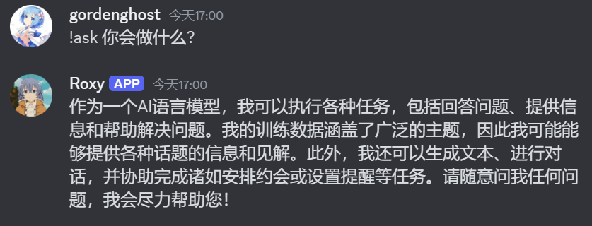
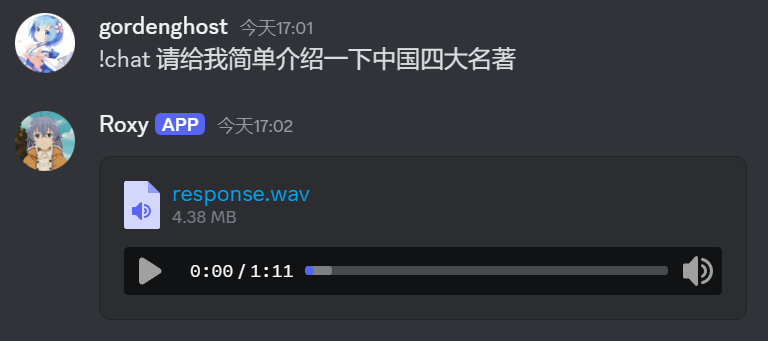
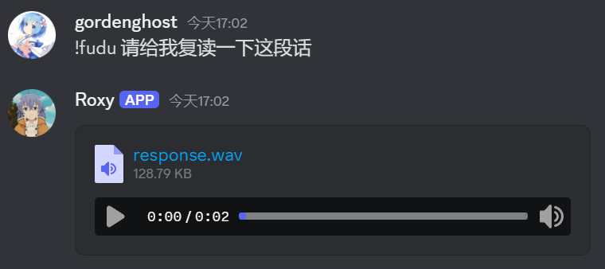

<h1 align="center">AI-Roxy in discord</h1>

部署在discord的简易的Roxy bot

___

###### 本项目是一个开箱即用的discord的bot项目, 通过将[MiniCPM](https://github.com/OpenBMB/MiniCPM)和[GPT-SoVITS](https://github.com/RVC-Boss/GPT-SoVITS?tab=readme-ov-file)加以组合, 创造出一个能够用洛淇希音色的大语言模型来与用户进行对话

本项目依附于项目:[MiniCPM](https://github.com/OpenBMB/MiniCPM)、[GPT-SoVITS](https://github.com/RVC-Boss/GPT-SoVITS?tab=readme-ov-file)、[gptsovits-api](https://github.com/jianchang512/gptsovits-api).

## 功能:

1. **文字对话** : 用户直接在discord上私信或在群聊中与bot进行对话.

2. **文字-语音对话** : 用户通过文字进行对话, 而bot用洛淇希的音色回复用户.

3. **复读** : bot用洛淇希的音色对用户的文本进行复读.

### 开箱方式:

1. 通过pip 的pip install -r requirements.txt指令安装到名为Roxy的conda环境或通过conda的 conda env create -f Roxy.yml -n Roxy直接安装对应的conda环境

2. 将main.py中第10行的DISCORD_TOKEN中的XXX替换为你的discord_bot的api.key

3. 运行start.bat

### 使用方法:

- 通过!ask 的方法来进行文字对话
  
  例 :!ask 你会做什么
  
  
  
  例 :!chat 请给我简单介绍一下中国四大名著
  
  

- 通过!fudu 的方式获取洛淇希音色的复读
  
  例 :!fudu 请给我复读一下这段话
  
  

#### 使用时应注意一下几点:

- 由于此项目使用了两个大模型作为支撑, 所以对于电脑性能有一定要求(特别是对于显存的要求), 经测试4060能够运行, 但bot的回复较慢.

- 在使用chat与fudu的指令时, 用户的交流语言应为中文.

- 本项目的模型记忆为持续记忆, 长时间使用所造成的记忆内容将会降低模型的运行速度.

- 本项目支持其他人物音色进行回答, 需用户自行替换模型与修改main.py和start.bat、prompt的相关内容.
